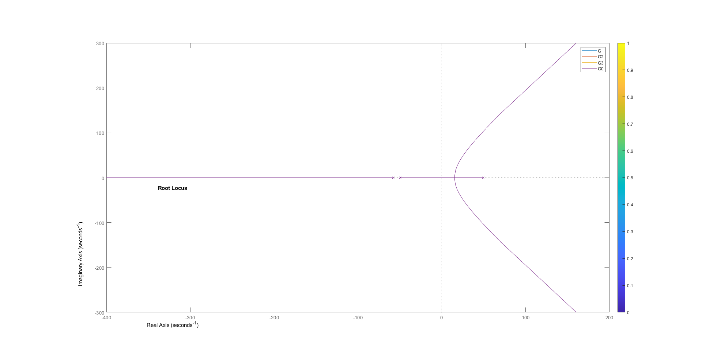

# Introduction

The objective of this complex engineering problem is to design a
controller for a magnetic levitation system as a classroom demonstration
device. The objective of a controller is to either stabilize a system if
the system is unstable or to meet specific characteristic requirements
that we require by our system.\
Given to us was a non-linear and unstable system - magnetic levitation
system - and we had to make it stable. In order to make a system linear
and stable, we have to first linearize it and then ensure that the
**closed loop poles** are in the **left half plane** of the
***S**-plane*.\
The initial equations of the system are:

$$f = C(\frac{i}{x})^2$$

$$e = Ri + L\frac{di}{dt}$$

$$m\frac{d^2x}{dt^2} = mg - f$$

Where\

-   $f$ electromagnetic force

-   $i$ coil current

-   $x$ distance between electromagnet and ball bearing

-   $C$ constant

-   $e$ voltage across the coil

-   $R$ coil resistance

-   $L$ coil resistance

-   $m$ mass of ball bearing

-   $g$ gravitational acceleration\

As described in the reference paper given to us [@b1], the system is
initially non-linear and linear controls theory can not be applied on
non-linear systems, hence we first make it linear. The linearized
equations describing the variations from the operating point are
obtained by using only the linear terms from the Taylor series
expansion. The linearlized equations are:

$$f_{1} = 2C(\frac{i_{0}}{x_{0}^2}i_{1} - \frac{i^2_{0}}{x_{0}^3}x_{1})$$

$$e_{1} = Ri_{1} + L\frac{di_{1}}{dt}$$

$$m\frac{d^2x}{dt^2} = mg - f_{1}$$

Once we obtain the linear equations and taking their Laplace, we can
obtain the characteristic equation of the system, which is:

$$Q(S) = x_{0}LmS^3 + x_{0}RmS^2 - ki_{0}LS - ki_{0}R + G_{C}(S)kx_{0}B = 0$$

\
where, $$k = 2C\frac{i_{0}}{x_{0}^2}$$

The sign changes in the characteristic equation indicates that the
system is unstable.\
Rearranging the above equation and putting in the values from the
refernce paper [@b1], we get:
$$Q(s) = 1 + \frac{60990 G_{C}(S)}{(S+49.5)(S-49.5)(S+58)} = 0$$

From the above equation, we know that the:

1.  Open loop poles are at: + 49.5, -49.5, +58

2.  There are no Open Loop Zeros.

3.  Value of gain is 60990

The block diagram of the system is:

<figure id="Block Diagram of system">

<figcaption>Block Diagram of system</figcaption>
</figure>

# Proportional Controller

\
Proportional controller is basically a gain **K~p~** being multiplied
with the error signal. This means:
$$G_{C}(S) = \textbf{K}_{p}$$

where,\

-   $G_{C}(S)$ is the proportional controller

-   $K_{p}$ is the proportional gain\

This signal is then cascaded with the system (**G(s)**). A proportional
controller is responsible for changes in the rise time of the system. As
our system is unstable, meaning it has a pole in the right half plane
and the closed loop poles also lie in right half plane, it can not be
made stable by just adding a proportional controller. We tested this out
on MATLAB. The code is as bellow:

    G = zpk([],[-49.5,49.5,-58],60990);
    G2 = zpk([],[-49.5,49.5,-58],60990*10);
    G3 = zpk([],[-49.5,49.5,-58],60990*100);
    G0 = zpk([],[-49.5,49.5,-58],1);
    rlocus(G0,G,G2,G3)

<figure id="fig">

<figcaption>Output of Proportional controllers with various
Kp</figcaption>
</figure>

In the above code, we gave different values of gain to the system and
made their root locus. As seen in the output, the system is still
unstable and the root loci of each system is at the same location no
matter what the gain is given. (We can see overlapping of all the root
loci)

# Lead compensator

To make the system stable, we have to add a lead compensator. In lead
compensation, we add a zero and a distant pole on the real axis. This
means: $$G_{C}(S) = \frac{K(S + z)}{S+p)}$$

where,\

-   $K$ is the gain

-   $z$ is the compensator's zero

-   $p$ is the compensator's pole\

In our case, we can make the system stable by adding a zero between the
origin and -49.5, while the distant pole of the compensator is placed
about 10 times from the zero's position [@b1].\
Since we just have to make the system stable and not meet any other
requirements, this means that we have infinite places to place our zero
and pole. Each pair will reshape the root loci differently.\
We choose different points to place our zero and then we plotted its
root locus. The MATLAB code is:

    % Adding a zero to 0 and to -49.5

    G_C = zpk([0],[-49.5,49.5,-58,-100],60990);
    G2_C = zpk([-49.5],[-49.5,49.5,-58,-495],60990);

    % Adding zeros at: -30,-35,-40,-45

    G_C_30 = zpk([-30],[-49.5,49.5,-58,-300],60990);
    G_C_35 = zpk([-35],[-49.5,49.5,-58,-350],60990);
    G_C_40 = zpk([-40],[-49.5,49.5,-58,-400],60990);
    G_C_45 = zpk([-45],[-49.5,49.5,-58,-450],60990);

    rlocus(G_C,G2_C,G_C_30,G_C_35,G_C_40,G_C_45)
    legend({'Zero at origin','Zero at -49.5', 'Zero at -30', 'Zero at -35', 'Zero at -40','Zero at -45'}, 'Location','northwest')

<figure id="fig">

<figcaption>Root Locus of various lead compensator systems</figcaption>
</figure>

From the above code, we get the root locus of all the systems with
compensated zeros and poles. After analyzing the different root loci, we
choose to move forward with the system where we are placing a zero at
-35 and a pole at -350. It is near to the existing pole at -49.5 of the
uncompensated system and gives a clean root loci.\
The next step is to find a suitable gain for the compensator. The gain
depends on the place of closed loop poles of the system. Since we are
not given any specifications such as overshoot or settling time, this
means we have, again, an infinite gains to choose from. However, not
each gain will give us a stable output. First we find the range of gains
that will give us a stable output.\
Value of gain can be found out easily by seeing where the root loci
intersects with a line drawn at the angle that is achieved by the cosine
of our zeta. So in short, the value of gain depends upon the the Zeta we
choose.\
This was achieved by this code on MATLAB:\

    G_C_35 = zpk([-35],[-49.5,49.5,-58,-350],60990);
    rlocus(G_C_35)
    Zeta = cosd(theta); %varying theta from 0 to 89 degrees with an increment of 5 degree.
    sgrid(Zeta,0)
    [k, p] = rlocfind(G_C_35)
    To = feedback(k*G_C_35,1);
    step(To)

From this code, we found out that we get use able values of gain from
about 65 degrees. All that was left is choose the right angle value from
which we will obtain zeta's value. After analyzing the step response
that we got from various values of theta, we choose to go with 75
degrees. This value of theta yields a value of 0.2588 for Zeta.\
When we run the above code for theta = 75, we get the outputs displayed
in figure [4](#Root Loci of our compensated system){reference-type="ref"
reference="Root Loci of our compensated system"} (the root loci of our
system) and
figure [5](#Step response of our compensated system){reference-type="ref"
reference="Step response of our compensated system"} (step response of
our system):

<figure id="Root Loci of our compensated system">

<figcaption>Root Loci of our compensated system</figcaption>
</figure>

<figure id="Step response of our compensated system">

<figcaption>Step response of our compensated system</figcaption>
</figure>

The value of gain $K$ comes out to 29.6 which yields an overshoot of
24.3%, settling time of 0.346 seconds and rise time of 0.0398 seconds as
seen in the step response of our system. In our opinion, these are
satisfactory characteristics of the system and these are also very close
to the ones in the given reference paper [@b1].\
Now that we have made a lead compensator i.e. $G_{C}(S)$
which is cascaded with our system, the overall equation of the system
becomes:
$$Q(s) = 1 + \frac{K'(S+35)}{(S+49.5)(S-49.5)(S+58(s+350)} = 0$$ 
Where

-   $K' = 60990 K$, $K:amplifier gain  (29.6)$

# Conclusion

In this project we had to stabilize an unstable system. First we tried
to stabilize it using a proportional controller but no matter what value
of gain we kept, the system stayed unstable and the root locus stayed at
the same location. Next, we made a lead compensator, with a zero at -35
and a pole at -350 on the real axis, which reshaped the root loci and
moved the closed loop poles in the left half plane of the S-plane. With
a zeta of value 0.25 and gain K of value 29.6. In the step response, the
overshoot for these values of zeta and gain is 24.3% and a settling time
of 0.34 seconds.\
These values are almost identical to the reference paper[@b1] we were
given.

# Bibliography

T. H. Wong, \"Design of a Magnetic Levitation Control System An
Undergraduate Project,\" in IEEE Transactions on Education, vol. E-29,
no. 4, pp. 196-200, Nov. 1986, doi: 10.1109/TE.1986.5570565. J. J.
D'azzo and C. H. Houpis. Linear Control System Analysis and Design,
Conventional and Modern. New York: McGraw-Hill, 1975.
